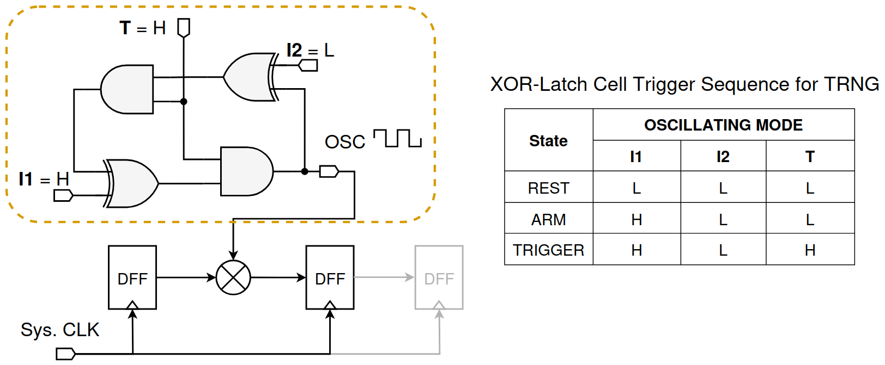
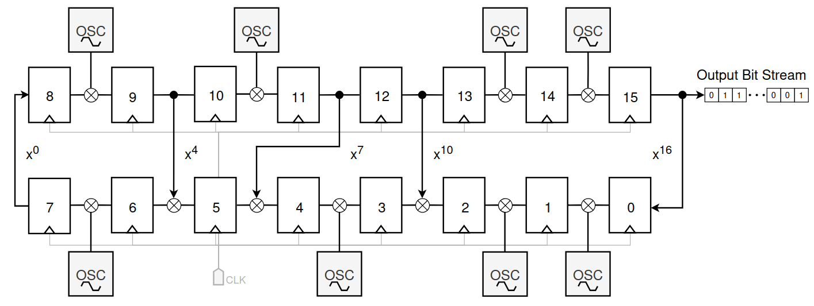

<!---

This file is used to generate your project datasheet. Please fill in the information below and delete any unused
sec## References

You can also include images in this folder and reference them in the markdown. Each image must be less than
512 kb in size, and the combined size of all images must be less than 1 MB.
-->
# True Random Number Generator (TRNG)
Author: Tuan-Kiet Dang

## What it does

This submission introduces a **True Random Number Generator (TRNG)** peripheral designed to harness jitter-based entropy sources from oscillators. 
While the design aims to provide high-quality randomness, comprehensive evaluation should be performed on silicon to confirm its effectiveness. This design has been implemented on FPGA and 180nm standard CMOS process [1][2][3]; however, as TRNG performance depends on the fabrication process, further testing on another process node is desirable.

The general architecture of the TRNG comprises of two main components: (1) XOR-latch entropy source and (2) ring generator. The main idea is applying the ring generator as an obfuscation layer in addition to sampled jitter edges to generate randomness.

### 1. XOR-latch Entropy Source

<p align="center">
    
</p>

The XOR-latch cell (in yellow box) consists of 2 XOR gates and 2 AND gates. Three input signals (I1, I2, T) are used to control the operation of the cell. Its output is sampled by the obfuscation layer. The trigger sequence to enable the entropy cell to oscillate is as followed, (L is logic-0, H is logic-1):

- At the REST state, I1 = I2 = T = L
- At the ARM state, I1 = H, I2 = L (or vice-versa I1 = L, I2 = H)
- To TRIGGER the oscillation, assert T = H

### 2. Ring Generator

The functionality of the ring generator is very similar to a **Linear Feedback Shift Register (LFSR)**. It is characterized by a polynomial, which determines the length of the ring generator and its feedback path. Initialized with a seed, the internal state of the ring generator iterates through a deterministic sequence—**like an LFSR, this can be used as a Pseudo-Random Number Generator (PRNG)**. For an $n$-state ring generator, the possible maximum-sequence length ($2^n-1$ states) depends on the chosen polynomial. The polynomials that enable the maximum-sequence are called primitive polynomials (for more details see [4]).

The TRNG main idea is to exploit the sampled jitter edges from the XOR-latch cell to break the deterministic behavior of the ring generator. Based on this idea, the major design decisions will be:

- What is the sufficient length of the ring generator?
- How many entropy cell should be injected to the ring generator?

### 3. General design:

<p align="center">
    
</p>

The above figure describe an example of a 16-state ring generator and eight entropy cells. The ring generator features the polynomial $x^{16}+x^{10}+x^7+x^4+1$. For longer ring generator, more entropy cells can be injected wherever there is a possible positions without disrupting the feedback path. From my experience with previous designs, not all entropy cells are required to be triggered, some of them are enabled for the 16-state ring generator and only one is sufficient for a 32-state ring generator to achieve high quality randomness.

This submission aims to test two ring generator with different length (32-state and 16-state), with a total of 24 entropy cells. The first eight cells are shared for both ring generators. Only one ring generator is active in the operation, and the entropy cells can be individually triggered by the memory-mapped interface.


### Key Features:
- **Dual Ring Generators**: Selectable between long (32-state polynomial) and short (16-state polynomial) ring generators
- **24 Entropy Cells**: Each generates entropy from ring oscillator jitter
- **Calibration Mode**: Configurable calibration cycles to stabilize the entropy sources
- **32-bit Random Output**: Serial collection of 32 random bits per read operation

### Testing Notes:
- It seems like the entropy cell can not be simulated with the python script (test.py).
- However, it is possible to test the functionality of other logic by forcing the entropy.cell to output a dummy logic-1.
- How-to-do: uncomment the test code in entropy_cell.v and comment the actual implementation of the entropy cell.

## Register Map

The TRNG peripheral uses a 6-address register map for configuration and data access:

| Address | Name                    | Access | Description                                                         |
|---------|-------------------------|--------|---------------------------------------------------------------------|
| 0x00    | CONTROL_REG            | R/W    | Control register for TRNG operations                               |
| 0x01    | STATUS_REG             | R    | Status register with ready bit                                      |
| 0x02    | CALIBRATION_CYCLES_REG | R/W    | Number of calibration cycles (32-bit value)                        |
| 0x03    | I1_REG                 | R/W    | Input I1 for entropy cells (bits 23:0 used)                       |
| 0x04    | I2_REG                 | R/W    | Input I2 for entropy cells (bits 23:0 used)                       |
| 0x05    | TRIGGER_REG            | R/W    | Trigger oscillator inputs for entropy cells (bits 23:0 used)      |
| 0x06    | Reserved  | R/W    |                                |
| 0x07    | RANDOM_NUMBER_REG      | R      | 32-bit random number output (read-only)                           |

### Control Register (0x00) Bit Fields:
| Bit | Name     | Access | Description                                    |
|-----|----------|--------|------------------------------------------------|
| 0   | RST      | R/W    | Software reset (1 = reset TRNG core)           |
| 1   | EN       | R/W    | Core enable (1 = enable TRNG core)             |
| 2   | SEL_BASE | R/W    | Ring generator selection (0 = long, 1 = short) |
| 3   | CALIB    | R/W    | Calibration enable (1 = start calibration)     |
| 4   | READ     | R/W    | Read request (1 = request new random number)   |
| 31:5| Reserved | R/W    | Unused                       |

### Status Register (0x01) Bit Fields:
| Bit | Name     | Access | Description                                    |
|-----|----------|--------|------------------------------------------------|
| 0   | READY    | R      | Ready status (1 = random number ready to read) |
| 31:1| Reserved | R/W    | Unused                                         |

## Operation Sequence

### 1. Initialization
The core can be reset by software with the first bit of the CONTROL_REG

```
1. Write CONTROL_REG[0] = 0x3 to enable & reset the TRNG core
2. Write CONTROL_REG[0] = 0x2 to release reset
3. [Optional] Configure the clock divider to allow the TRNG core run at lower frequency
    - Write to CLK_DIVISION_REG with [divisor] value (default 1)
```

### 2. Entropy Trigger & Ring Generator Selection
```
Trigger entropy cells:
1. Each entropy cell can be individually configured via I1_REG, I2_REG and TRIGGER_REG, the trigger sequence is as followed (example trigger cell[1] and cell[0])
    - Write I1_REG with 0x3 (arm cell[1] and cell[0])
    - Write I2_REG with 0x0 (bit[1] and bit[0] is oppsite)
    - Write TRIGGER_REG with 0x3 (trigger cell[1] and cell[0])
2. Select ring generator:
    - Write 0 to CONTROL_REG[1] to select the long ring generator
    - Write 1 to CONTROL_REG[1] to select the short ring generator
```

### 3. Calibration
```
1. Write CALIBRATION_CYCLES_REG with desired number of calibration cycles (default 2^11)
2. Write CONTROL_REG[2] = 1 to start calibration
3. Wait for STATUS_REG[0] = 1 (ready bit) indicating calibration complete
```

### 4. Random Number Generation
```
1. Ensure STATUS_REG[0] = 1 (TRNG is ready)
2. Write CONTROL_REG[3] = 1 to request new random number
3. Wait for STATUS_REG[0] = 1 (new random number ready)
4. Read RANDOM_NUMBER_REG to get 32-bit random value
5. Repeat steps 2-4 for additional random numbers
```

## References

[1] Tuan-Kiet Dang, *et al.*, "A True Random Number Generator on FPGA with Jitter-Sampling by Ring Generator," in *2024 Asian Hardware Oriented Security and Trust Symposium (AsianHOST)*, Kobe, Japan, 2024, pp. 1-6, doi: [10.1109/AsianHOST63913.2024.10838391](https://doi.org/10.1109/AsianHOST63913.2024.10838391).

[2] Tuan-Kiet Dang, *et al.*, "Dual-Mode PUF and TRNG Design with Ring Generator on 180nm CMOS," in *2025 International Conference on IC Design and Technology (ICICDT)*, Lecce, Italy, 2025, pp. 41-44, doi: [10.1109/ICICDT65192.2025.11078127](https://doi.org/10.1109/ICICDT65192.2025.11078127).

[3] Tuan-Kiet Dang, *et al.*, "A Unified Approach to Strong PUF and TRNG Using Ring Generator for Cryptography," *IEEE Internet of Things Journal*, doi: [10.1109/JIOT.2025.3582869](https://doi.org/10.1109/JIOT.2025.3582869).

[4] J. Rajski and J. Tyszer, "Primitive Polynomials Over GF(2) of Degree up to 660 with Uniformly Distributed Coefficients," *Journal of Electronic Testing*, vol. 19, no. 6, pp. 645–657, Dec. 2003, doi: [10.1023/A:1025937128748](https://doi.org/10.1023/A:1025937128748).